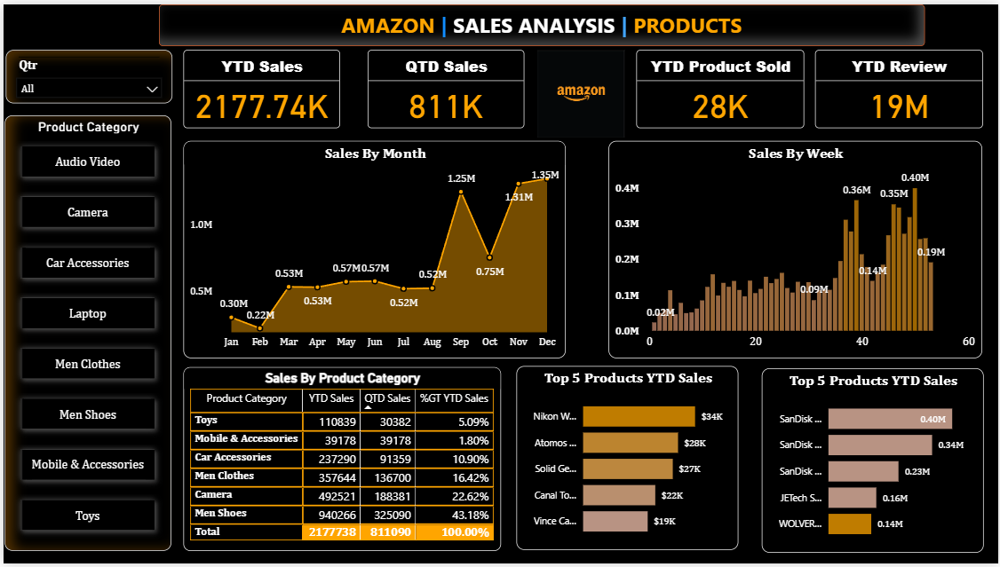

# 📊 Amazon Sales Analysis Dashboard (Power BI)

This project is a data visualization dashboard built using **Power BI**, focused on analyzing sales performance data from Amazon across multiple product categories.

---

## 📁 Project Overview

The dashboard provides key insights into:

- 📈 Monthly and Weekly Sales Trends
- 📦 Category-wise and Product-wise Sales
- 🌍 Performance by Region
- ⭐ Review and Product Rating Metrics
- 📊 Top 5 Performing Products

---

## 🚀 Tools & Technologies Used

- Power BI Desktop
- Power Query Editor
- DAX (Data Analysis Expressions)
- Excel / CSV Data Source

---

## 📸 Dashboard Preview



> *(Ensure the image is in the same repo or adjust the link if needed)*

---

## 🔍 Key KPIs Tracked

- **YTD Sales**: 2.17M+
- **QTD Sales**: 811K+
- **YTD Product Sold**: 28K
- **YTD Reviews**: 19M

---

## 📊 Visuals & Insights

- 📅 **Sales by Month** (Line + Area Chart)
- 📆 **Sales by Week** (Bar Chart)
- 🏷️ **Sales by Product Category** (Table with % of Total)
- 🔝 **Top 5 Products by Sales & Revenue**
- 🎯 Slicers to filter by **Quarter & Product Category**

---

## 📂 Project Structure

```
Amazon-Sales-PowerBI/
├── data/                          # Dataset files
├── images/
│   └── dashboard-screenshot.png  # Dashboard image
├── AmazonSalesDashboard.pbix     # Power BI report
└── README.md                     # This file
```

---

## 🧠 Insights

- Highest Sales in **December**: 1.35M
- **Men Shoes** category contributes ~43% of total sales
- **Camera** and **Mobile Accessories** are major revenue drivers
- **SanDisk** & **Nikon** appear in both top sales and revenue

---

## ⚙️ Next Steps / Enhancements

- Deploy to Power BI Cloud Service
- Add RLS (Row-Level Security) for user segmentation
- Schedule data refresh and share with stakeholders

---

## 🙌 Created By

**Sakthivel**  
📧 sakthivelait77@gmailcom  
🔗 linkedin.com/in/sakthivel-mohanraj
